<div align="center">

# 🔒 SecAudit 2.0 (SPPS)
### پلتفرم سازمانی و پیشرفته تحلیل، ممیزی و اسکن امنیت وب‌سایت و سورس کد
**Next-Generation Multi-Layer Website & Codebase Security Auditing Platform**

[](https://python.org)
[](LICENSE)
[](https://owasp.org)
[](https://sarifweb.azurewebsites.net/)
[]()

<br/>

**SecAudit (SPPS)** یک ابزار دفاعی، پرسرعت و چندنخی (Multithreaded) است که ارزیابی امنیت وب‌سایت‌های زنده (DAST)، تحلیل سورس کد و شکار کلیدهای محرمانه (SAST)، ممیزی فایل‌های داکر و زیرساخت (IaC)، و بررسی آسیب‌پذیری و لایسنس پکیج‌ها (SCA) را در یک پکیج جامع ادغام کرده است.

</div>

---

## 📑 فهرست مطالب (Table of Contents)

1. [✨ ویژگی‌های کلیدی](#-ویژگی‌های-کلیدی-key-features)
2. [🏗️ معماری چندلایه](#️-معماری-چندلایه-architecture)
3. [⚡ نصب و راه‌اندازی سریع](#-نصب-و-راه‌اندازی-سریع-installation)
4. [🚀 راهنمای جامع استفاده](#-راهنمای-جامع-استفاده-usage-guide)
   - [۱. منوی تعاملی و هوشمند](#۱-منوی-تعاملی-و-هوشمند-interactive-wizard)
   - [۲. اسکن وب‌سایت زنده (Live DAST)](#۲-اسکن-وبسایت-زنده-live-website-scan)
   - [۳. اسکن سورس کد و پروژه‌های محلی (SAST & SCA)](#۳-اسکن-سورس-کد-و-پروژه‌های-محلی-codebase-scan)
   - [۴. اسکن همه‌جانبه سازمانی (Full Enterprise Audit)](#۴-اسکن-همه‌جانبه-سازمانی-full-enterprise-audit)
5. [⚙️ جدول کامل گزینه‌ها و سوئیچ‌های CLI](#️-جدول-کامل-گزینه‌ها-و-سوئیچ‌های-cli)
6. [📊 فرمت‌های خروجی و گزارش‌دهی](#-فرمت‌های-خروجی-و-گزارش‌دهی-reporting)
7. [🤖 ادغام با گیت‌هاب و CI/CD (GitHub Actions)](#-ادغام-با-گیتهاب-و-cicd-github-actions)
8. [📂 ساختار پروژه](#-ساختار-پروژه-project-structure)

---

## ✨ ویژگی‌های کلیدی (Key Features)

### 🌐 ۱. تحلیل وب‌سایت زنده و شبکه (DAST & Network Security)
* **بررسی هدرهای امنیتی (Security Headers):** تحلیل دقیق هدرهای HSTS, CSP, X-Frame-Options, X-Content-Type-Options, Referrer-Policy و Permissions-Policy.
* **ارزیابی عمیق خط‌مشی محتوا (Deep CSP Evaluator):** کشف تله‌های خطرناک `unsafe-inline`, `unsafe-eval`, `data:` و نبود `frame-ancestors` یا `base-uri`.
* **بررسی امنیت DNS و ایمیل (SPF / DMARC / CAA):** استعلام رکوردهای ضدجعل و ضداسپوفینگ ایمیل به همراه رکوردهای CAA از طریق پروتکل امن DNS-over-HTTPS.
* **تشخیص تکنولوژی و فریم‌ورک‌ها (Tech Stack Fingerprinting):** شناسایی وب‌سرورها (Nginx, Apache, Caddy, Cloudflare)، فریم‌ورک‌های بک‌اند (Laravel, Django, Express, ASP.NET, Spring) و فرانت‌اند (React, Next.js, Vue, Nuxt, Angular, Tailwind).
* **بررسی متدهای خطرناک و نقایص CORS:** تست متد `TRACE` (باگ XST) و تست خودکار انعکاس Originهای ناامن با `credentials: true`.
* **بررسی SSL/TLS:** بررسی اعتبار گواهی، زنجیره اعتبار، تاریخ انقضا و هشدارهای نسخه‌های منسوخ TLS 1.0/1.1.
* **کاوش فایل‌های حساس رهاشده:** شناسایی خودکار فایل‌های کانفیگ و بک‌آپ مانند `.env`, `.git/HEAD`, `docker-compose.yml`, `phpinfo.php`, `robots.txt` و ...

### 🔍 ۲. تحلیل ایستای سورس کد و شکار اسرار (SAST & Secret Hunting)
* **کاشف جامع کلیدهای API و Secretها:**
  * کلیدهای هوش مصنوعی OpenAI (`sk-...` / `sk-proj-...`)
  * کلیدهای پرداخت و تراکنش مالی Stripe (`sk_live_...`)
  * توکن ربات‌های تلگرام و وب‌هوک‌های داخلی Slack
  * کلیدهای دسترسی خصوصی GitHub Personal Access Tokens
  * کانکشن‌استرینگ‌های دیتابیس (MongoDB, PostgreSQL, MySQL, Redis) حاوی نام‌کاربری و پسورد
  * کلیدهای دسترسی AWS Access Keys و کلیدهای خصوصی RSA/SSH
* **کشف آسیب‌پذیری‌های اجرایی و تزریق:**
  * توابع اجرای خطرناک (`eval`, `exec`, `os.system`, `pickle.loads`, `unserialize`)
  * الگوهای مستعد تزریق اس‌کیو‌ال (SQL Injection) عبر رشته‌سازی
  * تله‌های تزریق فرانت‌اند DOM XSS (`dangerouslySetInnerHTML`, `v-html`, `innerHTML`)
  * فعال بودن حالت دیباگ (`DEBUG = True`)، غیرفعال‌سازی توکن CSRF و دور زدن بررسی SSL (`verify=False`)
  * استفاده از الگوریتم‌های هش شکسته (MD5, SHA-1) و رندوم غیرایمن (`Math.random`)

### 🐳 ۳. ممیزی زیرساخت و کانتینرها (IaC Security)
* بررسی فایل‌های `Dockerfile` (اجرا با کاربر Root، استفاده از ایمیج‌های `:latest`، پسوردهای محیطی `ENV`).
* بررسی فایل‌های `docker-compose.yml` (حالت Privileged و پورت‌های دیتابیس مستقیماً افشا شده روی اینترنت مثل 27017، 3306، 5432، 6379).

### 📦 ۴. تحلیل وابستگی‌ها و ممیزی لایسنس (SCA & License Compliance)
* استعلام مستقیم آسیب‌پذیری‌های امنیتی CVE / GHSA از پایگاه داده رسمی **Google OSV.dev**.
* پشتیبانی از **۷ اکوسیستم نرم‌افزاری** و فایل‌های قفل:
  * **Node.js:** `package.json`, `package-lock.json`
  * **Python:** `requirements.txt`, `poetry.lock`
  * **PHP:** `composer.json`, `composer.lock`
  * **Rust:** `Cargo.lock`
  * **Go:** `go.mod`
* **ممیزی لایسنس (License Compliance):** شناسایی و هشدار لایسنس‌های کپی‌لفت و ویروسی (مانند AGPL-3.0, GPL-3.0).

### 💡 ۵. سیستم هوشمند تولید کانفیگ رفع باگ (Auto-Remediation Generator)
* تولید قطعه‌کدهای آماده کپی-پیست برای وب‌سرورها و فریم‌ورک‌های **Nginx**, **Apache**, **Node.js (Express/Helmet)**, **Laravel** و **Django** در داشبورد HTML.

---

## 🏗️ معماری چندلایه (Architecture)

```mermaid
graph TD
    CLI["رابط کاربری و خط فرمان (CLI / main.py)"] --> Orch["SecAudit 2.0 Multithreaded Engine"]
    
    subgraph DAST ["۱. ارزیابی پویا و شبکه (DAST)"]
        Orch --> DAST_Header["هدرهای امنیتی و کوکی‌ها"]
        Orch --> DAST_CSP["ارزیاب عمیق CSP"]
        Orch --> DAST_DNS["امنیت DNS و ایمیل (SPF/DMARC/CAA)"]
        Orch --> DAST_SSL["گواهی SSL/TLS و سایفرها"]
        Orch --> DAST_Tech["تشخیص تکنولوژی و فریم‌ورک"]
        Orch --> DAST_Files["فایل‌های حساس رهاشده (.env, .git)"]
        Orch --> DAST_CORS["متدهای HTTP و باگ‌های CORS"]
    end

    subgraph SAST_IaC ["۲. تحلیل کد و زیرساخت (SAST & IaC)"]
        Orch --> SAST_Secrets["کاشف جامع اسرار (OpenAI, Stripe, DB URIs)"]
        Orch --> SAST_Code["تحلیل الگوهای کد (SQLi, RCE, DOM XSS)"]
        Orch --> IaC_Docker["ممیزی Dockerfile و Docker Compose"]
    end

    subgraph SCA_Lic ["۳. پکیج‌ها و لایسنس (SCA & License)"]
        Orch --> SCA_OSV["استعلام پایگاه داده OSV.dev (۷ زبان)"]
        Orch --> Lic_Check["ممیزی ریسک حقوقی لایسنس‌ها"]
    end

    subgraph Out ["۴. گزارش‌دهی و اتوماسیون"]
        Orch --> Rep_Term["کنسول رنگی با Rich"]
        Orch --> Rep_HTML["داشبورد تعاملی Chart.js + Auto-Fix"]
        Orch --> Rep_JSON["خروجی داده‌ای JSON"]
        Orch --> Rep_SARIF["استاندارد SARIF برای CI/CD"]
    end
```



---

## ⚡ نصب و راه‌اندازی سریع (Installation)

### پیش‌نیازها:
* پایتون نسخه ۳.۱۰ یا بالاتر

```bash
# ۱. کلون کردن ریپازیتوری
git clone https://github.com/parsa2Cj/SPPS.git
cd SPPS

# ۲. ساخت و فعال‌سازی محیط مجازی (پیشنهادی)
python -m venv venv
# در ویندوز:
venv\Scripts\activate
# در لینوکس / مک:
source venv/bin/activate

# ۳. نصب وابستگی‌ها
pip install -r requirements.txt
```

---

## 🚀 راهنمای جامع استفاده (Usage Guide)

### ۱. منوی تعاملی و هوشمند (Interactive Wizard)
اگر دستور را بدون هیچ پارامتری اجرا کنید، ویزارد برنامه به سادگی شما را راهنمایی می‌کند:
```bash
python main.py
```

---

### ۲. اسکن وب‌سایت زنده (Live Website Scan)
بررسی هدرها، کوکی‌ها، SSL/TLS، رکوردهای DNS/DMARC/SPF، متدهای HTTP، تکنولوژی‌ها و فایل‌های حساس:
```bash
python main.py --url https://your-website.com
```

---

### ۳. اسکن سورس کد و پروژه‌های محلی (Codebase Scan)
بررسی کدهای منبع، توکن‌های محرمانه، فایل‌های داکر، وابستگی‌های پکیج‌ها و لایسنس‌ها:
```bash
# اسکن پوشه فعلی:
python main.py --dir .

# یا اسکن یک مسیر دلخواه در سیستم:
python main.py --dir "C:\Projects\my-awesome-app"
```

---

### ۴. اسکن همه‌جانبه سازمانی (Full Enterprise Audit)
اسکن همزمان وب‌سایت در حال اجرا و سورس کد با خروجی‌های همزمان HTML ،JSON و SARIF:
```bash
python main.py --url https://your-website.com --dir . --html reports/audit.html --json reports/audit.json --sarif reports/audit.sarif
```

---

## ⚙️ جدول کامل گزینه‌ها و سوئیچ‌های CLI

| پارامتر | عملکرد | مثال |
| :--- | :--- | :--- |
| `-u`, `--url` | آدرس وب‌سایت هدف جهت ارزیابی لایو DAST و شبکه | `--url https://example.com` |
| `-d`, `--dir` | مسیر دایرکتوری پروژه برای تحلیل SAST، داکر و پکیج‌ها | `--dir /path/to/project` |
| `--html` | مسیر فایل داشبورد تعاملی HTML (پیش‌فرض: `report.html`) | `--html my_report.html` |
| `--json` | مسیر فایل ساختاریافته JSON برای اتوماسیون داده‌ای | `--json output.json` |
| `--sarif` | مسیر فایل استاندارد OASIS SARIF v2.1.0 برای CI/CD | `--sarif results.sarif` |
| `--threads` | تعداد نخ‌های پردازش موازی برای افزایش سرعت (پیش‌فرض: 6) | `--threads 10` |
| `--timeout` | حداکثر زمان انتظار درخواست‌های وب به ثانیه (پیش‌فرض: 10) | `--timeout 15` |
| `--offline` | اجرای آفلاین بدون استعلام اینترنتی دیتابیس‌های آسیب‌پذیری | `--offline` |
| `--no-browser` | عدم باز شدن خودکار مرورگر پس از اتمام اسکن | `--no-browser` |

---

## 📊 فرمت‌های خروجی و گزارش‌دهی (Reporting)

1. **کنسول و ترمینال مدرن:** جدول‌بندی دقیق و رنگی یافته‌ها با نمایش شدت خطر، CVSS، موقعیت فایل و نمره کلی امنیت.
2. **داشبورد گرافیکی و تعاملی HTML:**
   * نمره‌دهی امنیتی از ۱۰۰ همراه با تعیین سطح کیفیت (A+ تا F).
   * نمودارهای آماری تحلیلی با **Chart.js** (نمودار دونات شدت و بارچارت دسته‌بندی).
   * تب‌های آماده کدهای اصلاحی (Auto-Fix Snippets) برای Nginx, Apache, Express, Laravel و Django.
   * نوار جستجوی آنی و فیلترهای ماتریسی بر اساس شدت خطر.
3. **فرمت استاندارد بین‌المللی SARIF:** جهت یکپارچه‌سازی با GitHub Code Scanning و تب Security گیت‌هاب.
4. **فرمت داده‌ای JSON:** حاوی تمام فیلدها و جزئیات دقیق یافته‌ها.

---

## 🤖 ادغام با گیت‌هاب و CI/CD (GitHub Actions)

شما می‌توانید با اضافه کردن فایل زیر در `.github/workflows/security.yml`، بررسی امنیت پروژه را در هر Commit یا Pull Request خودکار کنید:

```yaml
name: SecAudit Security Scan

on: [push, pull_request]

jobs:
  security-audit:
    runs-on: ubuntu-latest
    steps:
      - name: Checkout Code
        uses: actions/checkout@v4

      - name: Set up Python
        uses: actions/setup-python@v5
        with:
          python-version: "3.11"

      - name: Install SecAudit Dependencies
        run: |
          pip install requests rich jinja2 cryptography

      - name: Run SecAudit Scan
        run: |
          python main.py --dir . --sarif results.sarif --no-browser

      - name: Upload SARIF to GitHub Security Tab
        uses: github/codeql-action/upload-sarif@v3
        if: always()
        with:
          sarif_file: results.sarif
```

---

## 📂 ساختار پروژه (Project Structure)

```text
SPPS/
├── main.py                    # نقطه ورود اصلی خط فرمان (CLI Entrypoint)
├── requirements.txt           # پکیج‌های پایتون مورد نیاز
├── README.md                  # مستندات و راهنمای کامل فارسی
├── sec_audit/
│   ├── __init__.py
│   ├── config.py              # تعاریف قوانین امنیتی، الگوها و امضاها
│   ├── models.py              # ساختار داده‌های یافته‌ها و موتور نمره‌دهی
│   ├── orchestrator.py        # هماهنگ‌کننده چندنخی اسکنرها (Multithreaded)
│   ├── remediation/
│   │   ├── __init__.py
│   │   └── fix_generator.py   # موتور تولید خودکار کدهای رفع عیب (Nginx, Apache, ...)
│   ├── reporting/
│   │   ├── __init__.py
│   │   ├── terminal_reporter.py # گزارش خط فرمان با Rich
│   │   ├── json_reporter.py     # صدور داده‌های JSON
│   │   ├── sarif_reporter.py    # صدور فایل استاندارد SARIF v2.1.0
│   │   ├── html_reporter.py     # موتور رندر داشبورد
│   │   └── templates/
│   │       └── report_template.html # قالب داشبورد واکنش‌گرا و مدرن HTML
│   └── scanners/
│       ├── __init__.py
│       ├── header_scanner.py      # ارزیابی هدرهای امنیتی و کوکی‌ها
│       ├── csp_evaluator.py       # موتور تحلیل عمیق قوانین CSP
│       ├── ssl_scanner.py         # ارزیابی گواهی SSL/TLS و پروتکل‌ها
│       ├── dns_scanner.py         # ارزیابی رکوردهای SPF, DMARC, CAA
│       ├── tech_detector.py       # شناسایی تکنولوژی‌ها و فریم‌ورک‌ها
│       ├── cors_methods_scanner.py# بررسی متدهای HTTP و باگ‌های CORS
│       ├── sensitive_files_scanner.py # کاوش فایل‌های حساس رهاشده
│       ├── sast_scanner.py        # موتور جامع تحلیل سورس کد و شکار اسرار
│       ├── iac_scanner.py         # ممیزی امنیت Docker و Kubernetes
│       ├── sca_scanner.py         # ارزیابی پکیج‌ها با دیتابیس Google OSV
│       └── license_scanner.py     # ممیزی لایسنس‌های نرم‌افزاری
└── tests/
    └── test_audit.py          # آزمون‌های واحد خودکار (Unit Tests)
```

---

## 📄 لایسنس (License)

این پروژه تحت مجوز **[MIT License](LICENSE)** منتشر شده است و استفاده از آن برای اهداف شخصی، آموزشی و تجاری آزاد است.

<div align="center">
  <sub>توسعه‌یافته با ❤️ برای ارتقای امنیت وب و کدهای منبع</sub>
</div>
